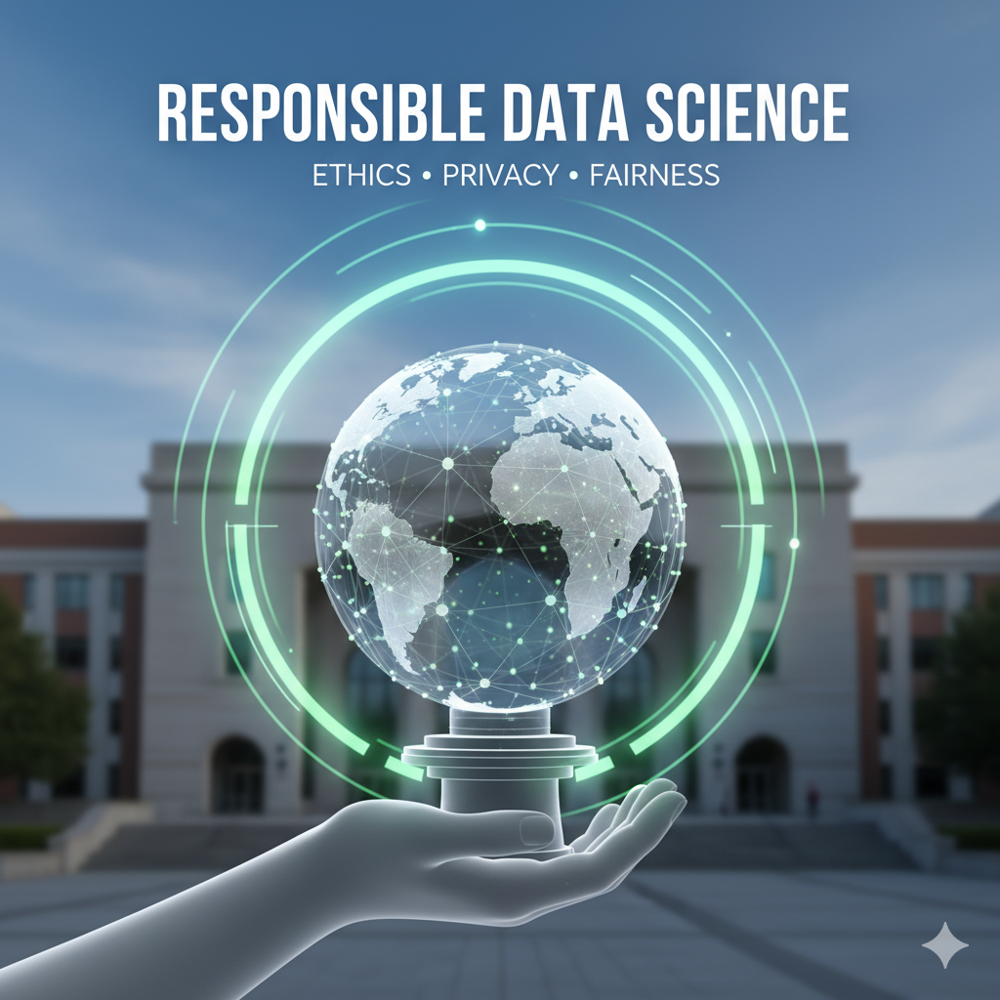

# DSC 261: Responsible Data Science 

## Description:

This course explores the foundations of **Responsible Data Science**, emphasizing rigorous methodology and ethical application. Students begin with **Causal Inference**, moving beyond correlation to uncover true causal relationships, and continue with **Algorithmic Fairness**, learning to detect and mitigate bias for equitable outcomes. The course also highlights **Data Valuation**, teaching how to measure and attribute the impact of datasets on model performance, alongside **Debugging and Data Selection**, where students develop practical skills for identifying data issues, refining inputs, and ensuring robustness. By integrating theory with applied techniques, the course prepares students to design, evaluate, and deploy data science methods that are both technically sound and socially responsible.

## Instructional team:

**Instructor:**

[Babak Salimi](https://bsalimi.github.io/), bsalimi@ucsd.edu

**Course Assistants:**

Jiongli Zhu, [jiz143@ucsd.edu](mailto:jiz143@ucsd.edu)   

Parjanya Prashant, [pprashant@ucsd.edu](mailto:pprashant@ucsd.edu)  

**Lectures**:

MWF	12:00p-12:50p

**Office Hours:**
Babak: TBD

TAs (Jiongli/Parjanya): Wednesday 1pm-2pm [Link](https://ucsd.zoom.us/j/96077507827)

**Note:** Office hours will be held via Zoom (link can be found on the Canvas calendar). 

### Course Workload

In this course, students will engage in a project-based and presentation learning experience, emphasizing teamwork, practical application of data science techniques, and effective communication. Groups of 5-6 students will collaborate to present papers and develop projects on topics relevant to the class.  

**Team formation**: Team formation details will be announced on Canvas. 

This course will involve paper presentations and projects. The grading break up is as follows: Paper Presentations (30%), Project Proposal(5%), Midterm Update (5%), Project Report (30%), Project Presentation (20%), Class Participation (10%).

#### Paper Presentation (Mid-Quarter)
Each team will present 2 related papers in one domain. The presentation will be **15 minutes**, followed by a **5-minute discussion**. Teams will sign up for the presentation topics [here](https://docs.google.com/spreadsheets/d/1PsbWYe7Vi7m3fyBHGGzsRIctUAR7zivzQTLJONyb10A/edit?usp=sharing)

Grading for the paper presentation is split as follows:
- Depth of Analysis (12%) – Understanding, critique, and synthesis of the papers.
- Clarity & Organization (9%) – Clear structure, effective visuals, and presentation.
- Discussion Engagement (6%) – Thoughtful questions and interaction with the audience.
- Team Collaboration (3%) – Equal contribution from all members.

#### Projects:
**Guidelines for Project**
Each project must
- Present a clearly defined hypothesis and contribute in at least one of the following areas:
   - Propose a novel theory or algorithm.
   - Apply an existing approach to a new domain.
   - Reimplement a paper (published at top ML venues like NeurIPS/ICLR/ICML) where no public code is available.
   - A comprehensive tutorial on one of the topics listed in the [presentation sheet](https://docs.google.com/spreadsheets/d/1PsbWYe7Vi7m3fyBHGGzsRIctUAR7zivzQTLJONyb10A/edit?usp=sharing). The tutorial must have some empirical results and analysis.

- Experiments should be rigorously designed, with well-defined, measurable metrics. All results must include error bars.
- For theory-focused projects, formal proofs are required.
- Please use this [template](https://www.overleaf.com/latex/templates/sample-acm-ccs/hqrzvbjgvfvz) for project reports.

**Note on Project grading**
Projects will be graded on contribution, effort, writing, and execution. Projects with thoughtfully designed experiments and solid execution will **not be penalized for yielding negative results**.

**Project Timeline**
The course will have three project checkpoints:
1. Initial Proposal: Due October 12 11:59 PM PST
2. Midterm Update: Due November 2 11:59 PST
3. Final Report: Date to be announced

Students are encouraged to meet with the instructor team regularly for guidance. The project will culminate in a short in-class presentation, where students will also create visual posters and dynamic presentations.

Titles and abstracts of courses in the last offering can be found here: [Past Projects](past_projects.md)

## **Calender:**

**(subject to change)**

# Course Calendar: 

| Week | Date  | Lecture Topics                         | Slides                                                                                                                                                                                                                                   | Readings |
|------|-------|----------------------------------------|------------------------------------------------------------------------------------------------------------------------------------------------------------------------------------------------------------------------------------------|----------|
| 1    | Sep 30| Introduction                           | [Introduction and Course Overview]() · [Introduction to Causal Inference](https://drive.google.com/file/d/1-c3cbYkAfX9MNF16m_-FiRi-ZzSt5PXU/view?usp=sharing) | * [Yuval Noah Harari argues that AI has hacked the operating system of human civilization](https://www.economist.com/by-invitation/2023/04/28/yuval-noah-harari-argues-that-ai-has-hacked-the-operating-system-of-human-civilisation) * [Book Extract: Yuval Noah Harari on AI](https://www.theguardian.com/technology/article/2024/aug/24/yuval-noah-harari-ai-book-extract-nexus) * [President Biden Issues Executive Order on Safe, Secure, and Trustworthy Artificial Intelligence](https://www.whitehouse.gov/briefing-room/statements-releases/2023/10/30/fact-sheet-president-biden-issues-executive-order-on-safe-secure-and-trustworthy-artificial-intelligence) * [AI, Fake News, and Misinformation](https://www.washingtonpost.com/technology/2023/12/17/ai-fake-news-misinformation/) * [Generative AI is the Ultimate Disinformation Amplifier](https://akademie.dw.com/en/generative-ai-is-the-ultimate-disinformation-amplifier/a-68593890) |
| 2    | Oct 7 | Graphical Models and Potential Outcomes| [Graphical Models]() · [Potential Outcomes]()                                   |          |
| 3    | Oct 14| Structural Causal Models               | [Structural Causal Models]()                                                                                                                            |          |
| 4    | Oct 21| Algorithmic Fairness                   | [Algorithmic Fairness]()                                                                                                                                |          |
| 5    | Oct 28| Bias Mitigation                        | [Bias Mitigation]()                                                                                                                                    | * [Optimal Transport Blog Post](https://alexhwilliams.info/itsneuronalblog/2020/10/09/optimal-transport/) * [Paper 1](https://arxiv.org/abs/2403.02372) · [Paper 2](https://arxiv.org/abs/2212.10839) |
| 6    | Nov 4 | —                                      |                                                                                                                                                                                                                                          |          |
| 7    | Nov 11| —                                      |                                                                                                                                                                                                                                          |          |
| 8    | Nov 18| —                                      |                                                                                                                                                                                                                                          |          |
| 9    | Nov 25| —                                      |                                                                                                                                                                                                                                          |          |
| 10   | Dec 2 | —                                      |                                                                                                                                                                                                                                          |          |

**Note**: The readings and slides are placeholders and should be replaced with actual links to resources.

## Textbook

[Causal Inference in Statistics: A Primer
](http://bayes.cs.ucla.edu/PRIMER/) 

[Trustworthy Machine Learning](http://www.trustworthymachinelearning.com/)

[Fairness and Machine Learning: Limitations and Opportunities](https://fairmlbook.org/)

[Interpretable Machine Learning
A Guide for Making Black Box Models Explainable](https://christophm.github.io/interpretable-ml-book/)

